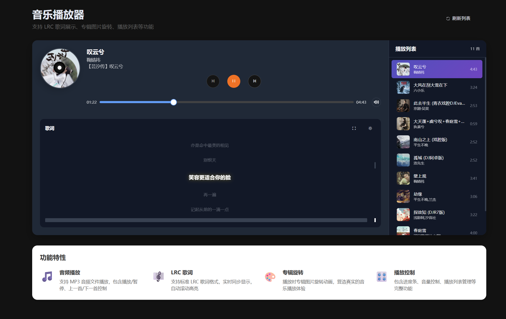

# AI Vibe Coding Products

## Projects

- [ai-simple-react-antd-admin](https://github.com/ycrao/ai-simple-react-antd-admin)：基于 `React + TypeScript + Vite + Ant Design` 构建的现代化后台管理系统。
- [web-screen-recorder](https://github.com/ycrao/web-screen-recorder)：一个功能强大的网页录制工具，[online demo](https://wsr.gh.1206168.xyz) 。
- [grid-music-player](https://github.com/ycrao/grid-music-player)：十二宫格效果的音乐播放器，可用于音乐合集视频剪辑制作，[online demo](https://gmp.gh.1206168.xyz) 。
- [google-alerts-mcp](https://github.com/ycrao/google-alerts-mcp)：一个 `MCP` 程序，可以从 `Google Alerts` 服务获取特定主题的新闻资讯。

## Scripts

- [scripts/port-scanner](scripts/port-scanner)：基于 Python 实现，一个简单的端口扫描器，用于检测目标主机上的开放端口。

## Screenshots

